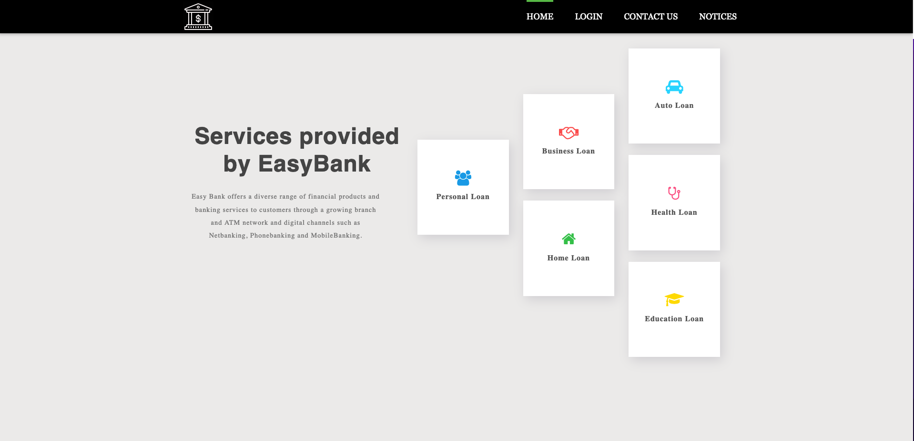
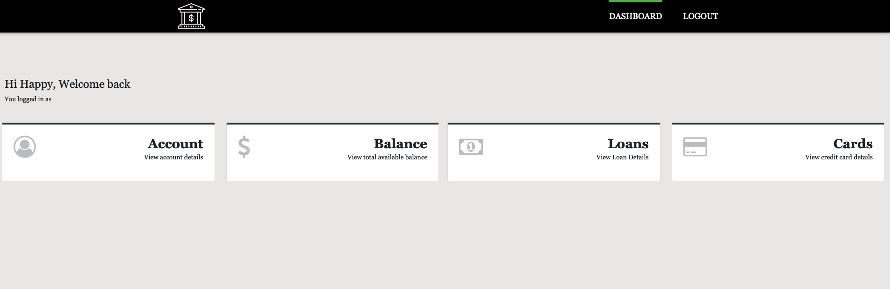
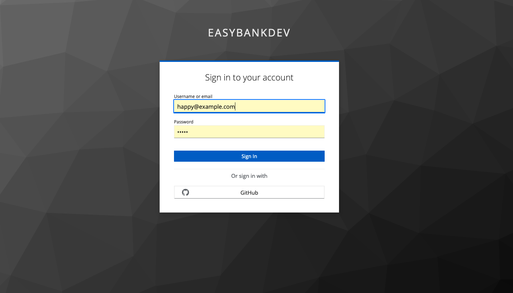

# Spring-Security
* This project is divided into different branches from 1 to 9

## The interface

## Topics covered in the project

* Spring Security framework details 
* How to adapt security for a Java web application using Spring Security
* Password Management in Spring Security with PasswordEncoders
* Deep dive about encoding, encryption and hashing
* What is CSRF, CORS and how to address them
* What is Authentication and Authorization. How they are different from each other.
* Securing endpoint URLs inside web applications using Ant, MVC & Regex Matchers
* Filters in Spring Security and how to write own custom filters
* Deep dive about JWT (JSON Web Tokens) and the role of them inside Authentication & Authorization
* Deep dive about OAUTH2 and various grant type flows inside OAUTH2.
* Deep dive about OpenID Connect & how it is related to OAUTH2
* Applying authorization rules using roles, authorities inside a web application using Spring Security
* Method level security in web/non-web applications
* Social Login integrations into web applications
* Set up of Authorization Server using KeyCloak 

